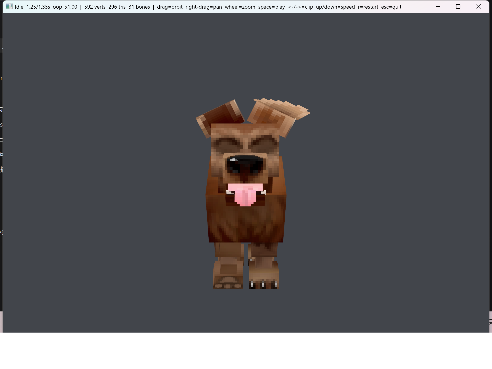
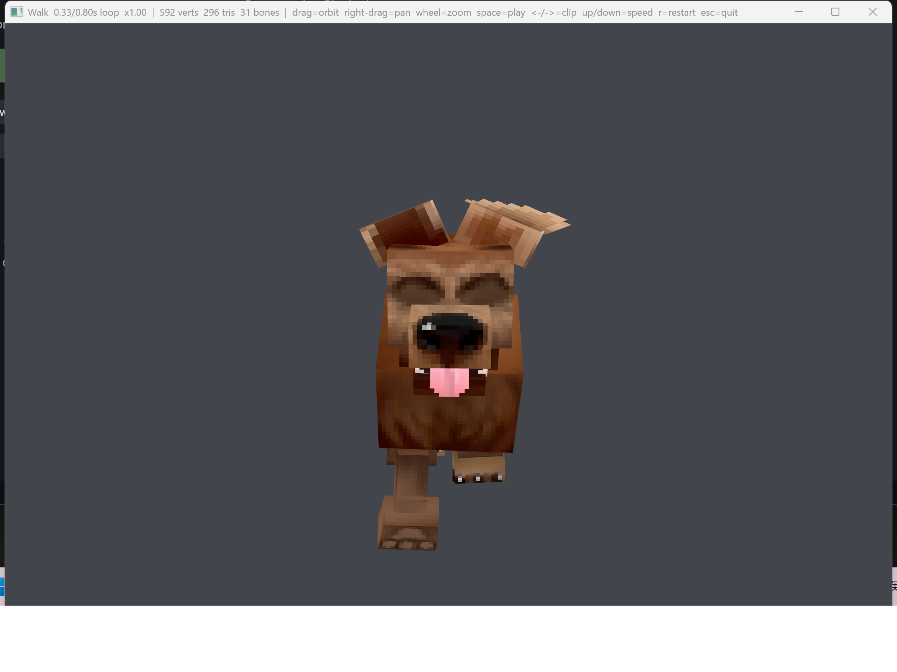

# HytaleAnim

Hytale `.blockymodel` / `.blockyanim` 的格式文档 + Rust/wgpu 播放器。

目标是把 Hytale 官方的 Blockbench 资产工作流完整用起来：**直接读游戏导出的资产，不经过任何中间转换**。

```
docs/blockymodel-format.md          # 格式规范（中文，含逐行验证过的 UV 与插值语义）
docs/porting-to-aether-terrain.md   # 移植到 D:\work\ttc\Aether_terrain 的清单
crates/blockymodel/                 # 解析 + 骨架 + 网格 + 动画采样（无 GPU 依赖）
crates/player/                      # 交互式播放器（wgpu 27 + winit 0.30）
Pets/Dog/                           # 待渲染的资产
```

## 快速开始

```bash
# 打印模型信息：节点数、包围盒、每个动作的时长、动画引用但不存在的骨骼
cargo run -p blockyanim-player -- --info

# 列出所有动作
cargo run -p blockyanim-player -- --list

# 打开播放器
cargo run -p blockyanim-player -- --anim Idle

# 换一个资产
cargo run -p blockyanim-player -- --model path/to/Model.blockymodel \
                                  --anims path/to/Animations
```

### 操作

| 输入 | 作用 |
|---|---|
| 左键拖拽 | 环绕 |
| 右键拖拽 | 平移 |
| 滚轮 | 缩放 |
| `空格` | 播放 / 暂停 |
| `←` / `→` | 上一个 / 下一个动作 |
| `1`–`9` | 跳到第 N 个动作 |
| `↑` / `↓` | 播放速度 |
| `,` / `.` | 单帧后退 / 前进 |
| `R` | 重播 |
| `Esc` | 退出 |

| `Idle` | `Walk` |
|---|---|
|  |  |

## 关键事实（详见 docs/blockymodel-format.md）

- 真正的扩展名是 **`.blockymodel`** 和 **`.blockyanim`**，都是普通 JSON。
- 坐标系：右手系，+Y 上，**+Z 前**（Hytale 的 `front` = Blockbench 的 `south`）。
- 角色模型 **1 方块 = 64 单位**（`Format.block_size = 64`）。Dog 的包围盒 `43.9 × 88.5 × 94.9` 单位 ≈ `0.69 × 1.38 × 1.48` 方块。
- `shape.stretch` 是**倍数**不是绝对值；动画里的 `shapeStretch` 通道也是**乘**上去的。
- 骨骼变换是 `bone_world(P) · T(P.shape.offset + N.position) · R(N.orientation)` —— **父节点的 shape.offset 要加进子节点的位置**，漏掉这项整个骨架会塌掉。
- 动画 **60 fps**，`duration` 单位是帧。
- 旋转通道用 **SLERP + 加权贝塞尔缓动**；平移/缩放通道用 **Catmull-Rom**。两者完全不同。
- 循环动画的尾段会**回绕**插值到第一个关键帧，而不是保持最后一帧。
- 动画**可以引用模型里不存在的骨骼名**（Dog 的动画里就有 `Collar`、`TailDog`），必须静默忽略。

## 与 Aether_terrain 的一致性

`crates/` 的依赖是照着 `D:\work\ttc\Aether_terrain` 定的，方便之后整块搬过去：

| | 本仓库 | Aether_terrain |
|---|---|---|
| 工具链 | `nightly-2026-06-13` | `nightly-2026-06-13` |
| edition | 2024 | 2024 |
| `wgpu` | 27 | 27.0.1（经 `yakui-wgpu` 锁定） |
| `winit` | 0.30.12 | 0.30.12 |
| 数学库 | `vek` 0.17.1（`repr_c`） | `vek` 0.17.1（`repr_c`） |
| 骨骼数据 | uniform 数组 | uniform 数组（`FigurePipeline`） |

移植清单见 `docs/porting-to-aether-terrain.md`。

## 测试

```bash
cargo test --workspace
```

25 个测试：6 个插值/缓动的单元测试、5 个相机约定测试，以及 13 个直接跑真实资产的集成测试 —— 钉住 bind pose 包围盒、UV 矩形、负 stretch 绕序、循环接缝、`holdLastKeyframe` 的尾段行为、以及动画引用未知骨骼时的健壮性。

## 构建环境

离线可构建：依赖都在本机 cargo 缓存里。加 `--offline` 即可。

## 参考实现来源

`ref/` 下是本仓库为逆向格式而克隆的参考项目（**均已加入 `.gitignore`，请勿提交**）：

- `ref/blockymodel-merger` — Go 实现，GPL-3.0
- `ref/hytale-blockbench-plugin` — Hypixel Studios 官方 Blockbench 插件，GPL-3.0
- `ref/blockbench` — Blockbench 本体（sparse checkout），GPL-3.0

本仓库自身的代码只从它们**提取了格式事实**（字段语义、数学公式），没有复制实现。
